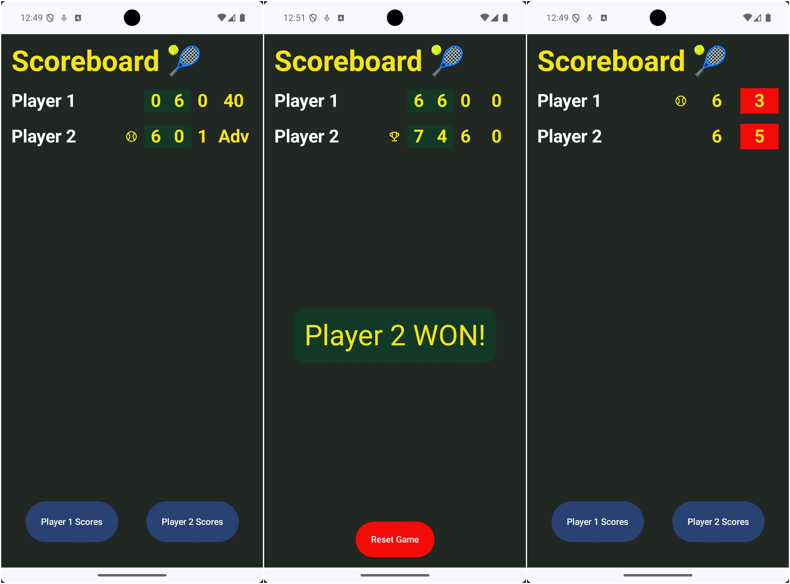

# Tennis ScoreBoard App

This is an educational project designed to simulate and manage the scoring system of a tennis match. This project follows the official rules of tennis, focusing on an accurate implementation of scoring mechanics, server rotation, tie-break handling, and match progression. It's also a demonstration of **clean architecture principles** and **modern Android development** using Jetpack Compose.

---

## Screen captures

---

## Features

- Simulate a tennis match with configurable sets (3 or 5 sets).
- Full support for regular games, tie-break games, and match-ending scenarios.
- Dynamic scoreboard reflecting real-time scores, serving player, and set history.
- Interactive UI with scoring buttons and winner announcements.
- Encapsulation of core tennis logic in reusable components.
- Flexible architecture with separate behaviors for scoring, serving, and winner determination.

---

## Rules Implemented

[Read here](RULES.md)

---

## Architecture

The **Tennis Scoring Application** is built using **clean architecture principles**, ensuring modularity, scalability, and testability.

### Architecture:

1. **Domain Layer**:
    - Contains the core logic and rules of the tennis match, encapsulated in:
        - `PointAnnotation`: Handles the annotation of points at the game, set, and match levels.
        - `WinnerCalculation`: Determines winners for games, sets, and matches.
        - `ServeRotation`: Handles the rotation of the serving player in regular games and tie-breaks.
        - `ScoreCalculation`: Is in charge of the scoring calculations of the values to display.
        - `TieBreakDetermination`: Detects if a game is in TieBreak.
    - Domain model states: `GameState`, `SetState`, and `MatchState` manage the state transitions.
    - Domain models: `Player`, `PlayerScore`, and `Point` manage the state transitions.
    - Composables are separated in three groups according to their complexity: `atoms`,`molecules` and `organisms`.

2. **Presentation Layer**:
    - Built using Jetpack Compose.
    - Displays the real-time match state, including scores, set history, and serving player.
    - Components such as `PlayerRow` and `ScoreBoard` dynamically render the match's progress.
    - State management is handled using `ScoreboardUiState`, which is updated based on domain layer outputs.

3. **Data Layer**:
    - Not implemented in this educational project but could be extended for persistence or remote API integration.

---

## Educational Goals

This project is ideal for learning:
- Tennis scoring rules and match mechanics.
- Clean architecture principles in Android development.
- State management and UI interactions with Jetpack Compose.
- Writing and maintaining robust unit tests.

---

## Contributing

If you'd like to contribute:
1. Fork the repository.
2. Submit a pull request with detailed explanations of your changes.

---

Enjoy learning and experimenting with this educational tennis scoring project! 🏆